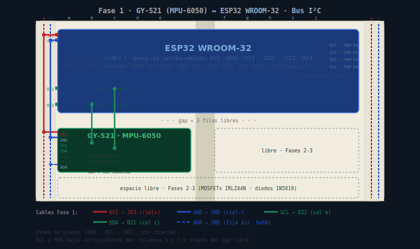

# Fase 1 — IMU MPU-6050: estimación de actitud (roll y pitch)

**Objetivo de ingeniería:** obtener una estimación de _roll_ y _pitch_ estable,
a tasa fija y medida, que sirva como **entrada de medición** de todo el control
posterior. No buscamos "leer un sensor": buscamos un estimador del que podamos
fiarnos, porque ningún controlador corrige una actitud mal medida.

> **Criterio rector de la fase:** la salida fusionada debe quedarse quieta en
> reposo (sin deriva apreciable) y seguir las inclinaciones físicas con
> fidelidad, a un `dt` fijo y conocido.

> **Solo ESP32.** La GY-521 usa lógica I²C de 3.3 V. El ESP32 es nativo 3.3 V,
> así que la unión es directa y limpia. El Uno (5 V) queda descartado para esta
> fase: era banco provisional, no plataforma de IMU.

---

## 1. Componentes

### 1.1 MPU-6050 (el sensor)

IMU de **6 grados de libertad** en un solo encapsulado: un **acelerómetro** de
3 ejes y un **giroscopio** de 3 ejes, ambos **MEMS** (estructuras micromecánicas
grabadas en silicio). Internamente tiene ADCs de 16 bits por eje y se configura
y se lee por I²C.

| Subsistema   | Qué mide                                        | Lo bueno                                           | Lo malo                                                       | Su misión aquí                                       |
| ------------ | ----------------------------------------------- | -------------------------------------------------- | ------------------------------------------------------------- | ---------------------------------------------------- |
| Acelerómetro | Aceleración propia; en reposo = vector gravedad | Referencia **absoluta** de inclinación, sin deriva | Ruidoso; se "tuerce" con cualquier aceleración lineal o golpe | Anclar el ángulo en el largo plazo (baja frecuencia) |
| Giroscopio   | Velocidad angular (°/s)                         | Suave y rápido; inmune a aceleraciones lineales    | **Deriva** sin límite al integrar; tiene _bias_               | Dar el ángulo en el corto plazo (alta frecuencia)    |

Son **complementarios en frecuencia**: cada uno es bueno justo donde el otro
falla. Esa es la base del filtro complementario.

### 1.2 GY-521 (la placa de ruptura)

Lleva la MPU-6050 y le añade lo necesario para usarla sin soldar el chip:
**regulador a 3.3 V**, **resistencias de pull-up** para SDA/SCL y los pines en
un header de 0.1". Por eso conectamos directo al ESP32 sin pull-ups externos.

### 1.3 Bus I²C

Bus serie de **dos hilos** compartido:

- **SDA** (datos) y **SCL** (reloj), ambos _open-drain_ con pull-up a 3.3 V.
- El ESP32 es el **maestro**; la IMU es un **esclavo** con dirección propia.
- Cada transacción empieza dirigiéndose a una dirección de 7 bits; el esclavo
  responde con **ACK**. Así sabemos si está presente (prueba T1).

### 1.4 Pin AD0 (selector de dirección)

Fija el último bit de la dirección I²C:

- `AD0 → GND` ⇒ dirección **0x68** (la que usamos).
- `AD0 → 3.3V` ⇒ dirección **0x69** (útil si algún día hay dos IMUs en el bus).

---

## 2. Conexión



```
GY-521        ESP32 WROOM-32        Color   Función
------        --------------        -----   -------
VCC    ---->  3V3                   rojo    alimentación 3.3 V
GND    ---->  GND                   gris    tierra común (referencia)
SDA    ---->  GPIO21                azul    datos I²C
SCL    ---->  GPIO22                verde   reloj I²C
AD0    ---->  GND (2.º pin GND)     gris    fija dirección 0x68
```

Notas de ingeniería:

- **GND común es obligatorio:** sin una tierra de referencia compartida, los
  niveles de SDA/SCL no significan nada y el bus no funciona.
- AD0 no lleva señal: es solo un nivel fijo. Lo llevo a un **segundo pin GND**
  del ESP32 para no apretar dos cables en el mismo borne.
- GPIO21/GPIO22 son los pines I²C por defecto del ESP32 (documentado en Fase 0).

---

## 3. El arco, etapa por etapa

### Etapa 1 — Bus y presencia (firmware `tools/scan_i2c.cpp`)

Primero validamos **solo la electrónica**. El escáner recorre todas las
direcciones del bus y reporta cuáles responden con ACK; luego lee `WHO_AM_I`.

- Si aparece `0x68` ⇒ cableado, alimentación y pull-ups están sanos (**T1**).
- Si `WHO_AM_I (0x75)` devuelve `0x68` ⇒ es _esta_ IMU, no un fantasma (**T2**).

> Uso: copia `tools/scan_i2c.cpp` a `src/main.cpp`, flashea, verifica T1/T2,
> y luego restaura el `src/main.cpp` del estimador para la Etapa 2.
> (Vive en `tools/` para que PlatformIO no lo compile junto al estimador y
> evite el conflicto de dos `setup()/loop()`.)

### Etapa 2 — Estimador completo (firmware `src/main.cpp`)

**1) Lectura cruda y conversión.** Se leen 14 bytes en **una sola ráfaga**
(accel, temperatura, gyro) empezando en `0x3B`. Se convierte a unidades físicas
con las sensibilidades del fondo de escala por defecto:

- accel: `±2 g → 16384 LSB/g`
- gyro: `±250 °/s → 131 LSB/(°/s)`

Trabajar en _g_ y _°/s_ (no en cuentas crudas) hace la física legible.

> Detalle fino: los dos bytes de cada eje se arman **después** de leerlos a un
> buffer. Combinarlos dentro de una misma expresión (`Wire.read()<<8 |
Wire.read()`) es un error sutil: el orden de evaluación no está garantizado
> en C++ y corrompería el dato.

**2) Calibración de bias.** Con el sensor inmóvil se promedian ~2000 muestras
del giroscopio; ese promedio **es** el bias (un gyro real no marca cero exacto
en reposo). Se resta en cada lectura. El esfuerzo va al gyro porque su bias es
la causa directa de la deriva; el offset del acelerómetro lo dejamos pasar
porque la gravedad domina y solo desplaza el ángulo unas décimas.

**3) Ángulo por dos caminos.**

- Acelerómetro (vector gravedad):
  `roll = atan2(ay, az)`, `pitch = atan2(-ax, √(ay² + az²))`.
  Referencia absoluta, sin deriva, pero ruidosa.
- Giroscopio (integración): `ángulo += ω · dt`.
  Suave y rápido, pero deriva.

**4) Filtro complementario.**
`θ = α · (θ + ω·dt) + (1 − α) · θ_accel`
Es un **pasa-altos** al gyro y un **pasa-bajos** al accel. La forma honesta de
leer `α` es como **constante de tiempo**:

```
tau = alpha * dt / (1 - alpha)
```

Con `α = 0.98` y `dt = 5 ms` ⇒ `τ ≈ 0.245 s`, cruce ≈ `1/(2πτ) ≈ 0.65 Hz`.

- Por debajo del cruce manda el **acelerómetro** (corrige la deriva).
- Por encima manda el **giroscopio** (suaviza y responde rápido).
- Subir `α` = confiar más en el gyro = más suave, pero corrige la deriva más
  lento. Bajarlo = sigue más al accel = corrige rápido pero entra más ruido.

**5) Lazo a `dt` fijo (200 Hz) con `micros()`.** Reusamos el patrón no
bloqueante de la Fase 0, pero con `micros()` en vez de `millis()`: con
`dt = 5 ms`, la resolución de 1 ms de `millis()` sería ~20 % de error en `dt`, y
`dt` entra **multiplicando** en la integración del gyro y en la constante de
tiempo. Se mide el `dt` **real** en cada vuelta y se reporta. Este `dt` es el
germen del tiempo de muestreo del controlador.

---

## 4. Tres aclaraciones conceptuales

**Por qué el yaw NO es observable aquí.** El acelerómetro solo ve la gravedad,
un vector que apunta hacia abajo. _Roll_ y _pitch_ cambian su proyección sobre
los ejes (por eso se observan). El _yaw_ gira alrededor del eje vertical, y la
gravedad es **invariante** bajo esa rotación: no aporta información. El gyro mide
velocidad de yaw, pero integrarla deriva sin nada que la corrija. Para hacer el
yaw observable hace falta un vector externo horizontal: el campo magnético
(magnetómetro). Sin él, el yaw flota.

**Por qué Euler y no cuaterniones a este nivel.** Para solo _roll/pitch_ cerca
del estacionario, Euler es intuitivo y el filtro se vuelve aritmética escalar
por eje. Los cuaterniones evitan el _gimbal lock_ (singularidad en pitch = ±90°)
y manejan actitud 3D completa con yaw, pero aquí no hay yaw ni nos acercamos a
±90°. Euler es más claro y la singularidad queda lejísimos. Los cuaterniones se
ganan su lugar en vuelo libre agresivo (Fase 7).

**Por qué fusión "a mano" y no el DMP interno.** El DMP es una caja negra que
entrega un cuaternión ya cocinado, a una tasa que él decide. Para un curso de
control, eso esconde justo lo que venimos a aprender: el dato crudo, el bias, la
deriva, el filtro como mezcla en frecuencia y —crítico— el control del `dt` que
alimenta al controlador. A mano = transparencia total y un pipeline que es
nuestro (el día de mañana, cambiar el complementario por un Kalman).

---

## 5. Pruebas de verificación

| #   | Prueba           | Acción                                     | Resultado esperado                            |
| --- | ---------------- | ------------------------------------------ | --------------------------------------------- |
| T1  | Bus              | Correr el escáner I²C                      | Reporta un dispositivo en `0x68`              |
| T2  | WHO_AM_I         | Leer registro `0x75`                       | Devuelve `0x68`                               |
| T3  | Reposo coherente | Sensor plano y quieto                      | `az ≈ +1 g`, `ax,ay ≈ 0`, `gyro ≈ 0`          |
| T4  | Gravedad         | Inclinar 90° por cada eje                  | Aparece `±1 g` en el eje que toca             |
| T5  | Deriva del gyro  | Mirar `GYRang` en reposo                   | Crece lento y sin techo (evidencia la deriva) |
| T6  | Fusión estable   | Mirar `FUS` en reposo y al inclinar        | Quieto en reposo; sigue la inclinación real   |
| T7  | Rechazo a golpe  | Golpear la mesa (sin mover el ángulo real) | `FUS` apenas se inmuta y vuelve solo          |
| T8  | Tasa de lazo     | Leer `dt` y `f` en la telemetría           | `dt ≈ 0.005 s`, `f ≈ 200 Hz`, estables        |

Sugerencia: para T5–T7, el **Serial Plotter** de PlatformIO muestra muy bien la
diferencia entre `GYRang` (deriva), `ACCang` (ruido/saltos) y `FUS` (limpio).

---

## 6. Criterio de aceptación

> La fase se supera cuando, **simultáneamente**:
>
> - T1 y T2 pasan (bus e identidad confirmados).
> - En reposo, `roll` y `pitch` fusionados se mantienen estables (**±1–2°**) sin
>   deriva apreciable durante varios minutos.
> - Al inclinar físicamente, `FUS` sigue el movimiento con fidelidad razonable.
> - Un golpe a la mesa (T7) no produce un salto persistente en `FUS`.
> - El `dt` es fijo y medido (`f ≈ 200 Hz`).

---

## 7. Errores frecuentes

| Síntoma                                               | Causa probable                                    | Solución                                                     |
| ----------------------------------------------------- | ------------------------------------------------- | ------------------------------------------------------------ |
| Escáner no reporta nada                               | GND no común; VCC en 5 V; cables SDA/SCL cruzados | Revisar tierra común, alimentar a 3.3 V, verificar GPIO21/22 |
| Aparece `0x68` pero datos en cero                     | Sensor en _sleep_                                 | Escribir `PWR_MGMT_1` para despertarlo (lo hace `setup()`)   |
| Ángulo fusionado se va al lado contrario o se dispara | Convención de signos del gyro vs. accel           | Invertir el signo de `gxd`/`gyd` del eje afectado            |
| Deriva fuerte en reposo                               | Sensor movido durante la calibración              | Recalibrar totalmente inmóvil                                |
| `dt` salta o `f` inestable                            | Trabajo bloqueante (delays largos) en el lazo     | Mantener el lazo no bloqueante; impresión acotada            |

---

## 8. Entrada de bitácora (sugerida)

```
## Fase 1 — IMU MPU-6050 (roll/pitch sobre ESP32)
- Cableado I²C (0x68) validado: T1 y T2 OK.
- Pipeline a mano: crudo -> g/°·s -> bias gyro -> accel/gyro -> complementario.
- alpha=0.98, dt=5 ms (200 Hz) -> tau ≈ 0.245 s. Lazo con micros().
- Decidido: Euler (no cuaterniones) y fusión propia (no DMP) por transparencia
  y control del dt; yaw no observable sin magnetómetro.
- Pendiente: registrar resultados de T3–T8 y firmar criterio de aceptación.
```
